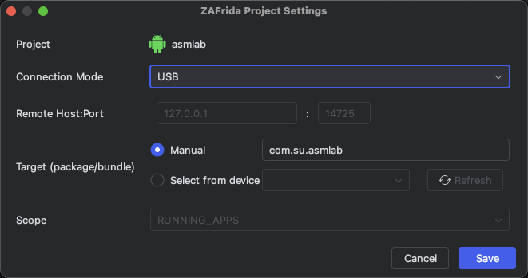

[中文](./README.md) | English

ZAFrida UI - PyCharm Frida Plugin
===============

Current Version: 0.1.3

Project Introduction
-----------------------------------

<h3 align="center">Frida GUI Tool for PyCharm/IntelliJ</h3>

ZAFrida UI is a Frida graphical interface plugin integrated into PyCharm and JetBrains IDEs. It aims to solve the complexity of Frida command-line operations and script management by providing a complete **UI interaction interface** to manage devices, processes, scripts, and logs.

The core highlight is its **"Checkbox-style" Template Management System**: users can dynamically insert code snippets into the main script or comment them out simply by checking/unchecking boxes, enabling a "block-building" style of Hook script assembly. Additionally, the plugin features built-in **Project Management** (`zafrida-project.xml`), supporting quick switching between multiple devices and environment configurations.

ZAFrida does not replace Frida but serves as a powerful UI wrapper for `frida-tools`, seamlessly connecting with your existing Python and Frida environment.

## Home

Quick Start
-----------------------------------

1.  **Install Plugin**: Search for "ZAFrida" in the IDE Plugin Marketplace or install via disk.
2.  **Configure Environment**: Go to `Settings` -> `Tools` -> `ZAFrida` and configure `frida` executable paths (if not auto-detected).
3.  **Create Project**: Right-click in Project View -> `New Frida Project`.
4.  **Write/Select Script**: Select your `agent.js` in the Run Panel.
5.  **Hook & Debug**:
    * Connect device (USB or Remote).
    * Select target process or package name.
    * Click **Run**.
6.  **Use Templates**: Switch to the `Templates` tab, check the Hook functions you need (e.g., "SSL Pinning Bypass"), and the code will be automatically injected into your script.

Features
-----------------------------------

* **Device & Process Management**: Integrated with `frida-ls-devices` and `frida-ps`. Supports one-click refresh of device lists and viewing running processes, running apps, or installed applications.
* **Multi-Mode Connection**: Full support for **USB**, **Remote**, and **Gadget** modes. Supports custom Remote Host and Port without complex command-line arguments.
* **Interactive Script Execution**:
    * Supports **Spawn** (`-f`) and **Attach** (`-p`/`-n`) modes.
    * Supports **Force Stop** for target applications.
    * Built-in console log output with automatic log saving to the `zafrida-logs/` directory.
* **Dynamic Template System (Core Innovation)**:
    * Provides common Android/iOS Hook templates (e.g., SSL Pinning Bypass, Method Hook, Native Hook).
    * **Checkbox Control**: Check to enable (insert code), uncheck to disable (auto-comment code). No need to delete code manually.
    * Supports custom templates and real-time preview from the IDE editor.
* **Project Configuration**:
    * Introduces the "ZAFrida Project" concept, saving specific App Hook configurations (package name, script path, connection params) as config files.
    * Supports creating and switching between different Frida projects within the IDE.
* **Smart Environment Resolution**: Automatically detects the current PyCharm project's Python environment (venv/conda) to ensure the correct `frida` toolchain is used.
* **Development Aids**: Supports one-click installation of `frida-gum.d.ts` for intelligent code completion in JS scripts.

Use Cases
-----------------------------------
ZAFrida UI is suitable for all scenarios involving reverse engineering with Frida, especially:
* Android / iOS App penetration testing and reverse analysis.
* Debugging processes requiring frequent switching of different Hook scripts.
* Engineers accustomed to using IDEs (PyCharm/IDEA) for mixed Python and JS development.

Technical Documentation
-----------------------------------

- **Requirements**:
    - IntelliJ IDEA or PyCharm (Recommended 2024.3+)
    - Python3 and `frida-tools` installed locally (`pip install frida-tools`)
    - Ensure `frida`, `frida-ps`, and `frida-ls-devices` are in the system PATH or configured in plugin settings.

- **Issues**: [Github Issues](https://github.com/yilongmd/zafrida-ui/issues)

Start the Project
-----------------------------------

1.  Clone source: `git clone https://github.com/yilongmd/zafrida-ui.git`
2.  Open the project in IntelliJ IDEA.
3.  Run the Gradle task `runIde` to start the debug environment.

System Effect
-----------------------------------

##### Main Interface & Run Panel
> Provides device selection, script selection, run mode configuration, and console output.

##### Template Management Panel
> Select categories on the left, check templates in the middle, and preview code on the right. Checkboxes directly control the effectiveness of script content.

##### Settings
> Supports customizing Frida tool paths, remote connection addresses, and log configurations.

##### Project Wizard
> Quickly create standardized Frida project structures.

Technical Architecture
-----------------------------------

#### Development Environment
- Language: Java 21, Kotlin
- Framework: IntelliJ Platform SDK
- Build Tool: Gradle
- Dependency: `frida` `frida-tools` (Python environment)

Acknowledgements
-----------------------------------
Special thanks to the following contributors for providing core Frida JS script templates:

* **小佳**
* **Lane**
* **迷人**