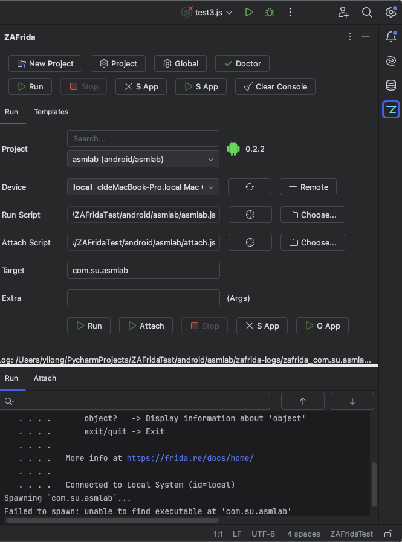
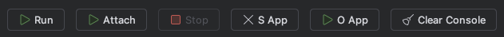
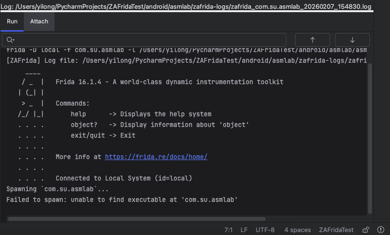

# ZAFrida UI Detailed User Wiki
## Table of Contents

- [Home](#home)
- [00 QuickStart](#sec-00-quickstart)
- [01 Prepare Environment](#sec-01-prepare)
- [02 Install Plugin](#sec-02-install)
- [03 Environment Doctor](#sec-03-doctor)
- [04 Project Management](#sec-04-projects)
- [05 Run Panel](#sec-05-run-panel)
- [06 Editor Run/Attach](#sec-06-editor-run-attach)
- [07 Snippets](#sec-07-snippets)
- [08 Templates](#sec-08-templates)
- [09 Logs and Console](#sec-09-logs-console)
- [10 Notifications](#sec-10-notifications)
- [11 Troubleshooting](#sec-11-troubleshooting)
- [12 FAQ](#sec-12-faq)
- [13 Shortcuts and Tips](#sec-13-shortcuts-tips)
---

<a id="home"></a>

## ZAFrida UI User Wiki (v0.2.6)

> Target readers: people who use Frida for Android/iOS reversing, Hook debugging, or PoC validation; and want to manage scripts, devices, targets, and logs in a project-style workflow.

---

<a id="sec-00-quickstart"></a>

## 00 QuickStart (finish in 3 minutes)

Goal: **run Run / Attach inside the IDE for the first time**, and confirm your environment works.

---

### 0x00 What you need

- JetBrains IDE: PyCharm (recommended) or IntelliJ (requires the Python plugin)
- Local Python 3 (venv/conda recommended)
- `frida-tools` installed
- Device side prepared per your workflow:
  - Android: frida-server / frida-gadget
  - iOS: frida-server / gadget (or your injection method)
---

### 0x01 Install the plugin

- IDE -> Plugins -> Marketplace -> search **ZAFrida** -> Install
- Restart the IDE (if prompted)

>

---

### 0x02 Open the ZAFrida ToolWindow

- IDE right side ToolWindow -> open **ZAFrida**

First open usually auto pops **Environment Doctor**:


---

### 0x03 Create your first ZAFrida Project

Two entry points, choose either:

- Project View right click -> **New Frida Project**
- ZAFrida tool window top bar -> **New Project**

Choose platform (Android/iOS) + project name -> Create


---

### 0x04 In the Run panel, fill 4 fields then Run

In the **Run** panel:

1. **Project**: select your project
2. **Device**: refresh and select device
3. **Run Script**: select default `xxx.js` under the project (or your own `agent.js`)
4. **Target**: package name / process name (usually package name)

Then click:

- **Run** (Spawn) or
- **Attach** (inject into running process)


---

### 0x05 Verify: logs show up and file is created

- Console output appears
- `zafrida-logs/` is created under the project directory
- Run panel bottom `Log:` shows the log file path


---

Next steps:
- [03-Doctor](03-Doctor) (run Doctor first if environment is unstable)
- [06-Editor-Run-Attach](06-Editor-Run-Attach) (the key highlight: editor right click Run/Attach, ideal for multi-app, multi-device, and multi-connection-mode debugging)

---

<a id="sec-01-prepare"></a>

## 01 Prepare Environment (IDE / Python / Frida / Device)

This page does two things: **make Doctor all green**, and ensure you can run frida-tools from the terminal.

---

### 0x00 IDE selection and requirements

- Recommended: **PyCharm 2024.3+**
- IntelliJ IDEA also works, but you must install/enable **Python plugin** (or Doctor may fail to parse Python SDK)
---

### 0x01 Python environment (strongly recommend venv/conda)

Minimum requirement: the current IDE project can resolve a Python Interpreter.
```bash
pip install frida==<recommended version, e.g., 16.5.7>
pip install frida-tools==<match the frida version>
```

Verify:

```bash
frida --version
frida-ls-devices
```

---

### 0x02 Device-side preparation

For Android/iOS, just make sure your normal CLI workflow can connect.

---

### 0x03 If you only do one thing: run Doctor

Open ZAFrida -> click **Doctor** -> all checks success.

- [03-Doctor](03-Doctor)

---

<a id="sec-02-install"></a>

## 02 Install Plugin (ZAFrida UI)

---

### 0x00 Install from Marketplace (recommended)

1. IDE -> **Plugins**
2. Marketplace search: `ZAFrida`
3. Install -> Restart IDE


---

### 0x01 Install from disk (offline/self build)

1. Download plugin package (zip) from GitHub Releases
2. IDE -> Plugins -> Settings icon -> Install Plugin from Disk...
3. Select zip -> Restart
---

### 0x02 Open settings entry

- IDE Settings/Preferences -> **Tools** -> **ZAFrida**

- If previous steps are correct, you can leave settings unchanged unless you want to customize global configs

---

<a id="sec-03-doctor"></a>

## 03 Environment Doctor

Environment Doctor turns environment issues into **actionable checks**. Highly recommended to run once on first use.

---

### 0x00 When does it appear?

- **First time opening ZAFrida ToolWindow**: auto pops
- Later you can open anytime: top bar **Doctor** button


---

---

### 0x01 How to fix common failures

#### A. Project Python SDK failed

- IDE -> Settings -> Python Interpreter
- Choose a valid interpreter (venv/conda is fine)

#### B. Frida Tools Path / frida --version failed

- Ensure `frida-tools` is installed in current Python env: `pip show frida-tools`
- Or manually configure `frida / frida-ps / frida-ls-devices` paths in ZAFrida Settings

#### C. frida-ls-devices failed

- Device frida-server not running / port blocked / version mismatch

#### D. adb availability failed

- Install Android SDK platform-tools and add `adb` to PATH
- This check is optional, not mandatory

---

<a id="sec-04-projects"></a>

## 04 ZAFrida Project Management (New / Load / Select)

A ZAFrida "project" is your core daily reversing context: scripts, target, connection mode, device, extra args all travel together.

---

### 0x00 Three entry points (all in Project View right click)

Right click any directory in Project View:

- **New Frida Project**: create a new project (recommended for beginners)
- **Load Frida Project**: load an existing project directory into workspace
- **Select Frida Project**: set one loaded project as active

> If you run from JS files directly via Run Frida JS, switching projects is more convenient than Select Frida Project (this entry point is kept for early design compatibility). It is also a natural fit for multi-app, multi-device, and multi-connection-mode debugging.

---

### 0x01 When to use Load?

Typical scenarios:

- You got a full `android/app_xxx/` directory from a teammate
- Or you keep a project directory with `zafrida-project.xml`

Requirement: `zafrida-project.xml` must exist in the directory.


---

### 0x02 When to use Select?

When you maintain multiple target apps:

- Load (or New) multiple projects
- Then Select to switch active project
  (the Project dropdown in Run panel also switches)
---

<a id="sec-05-run-panel"></a>

## 05 Run Panel (Device / Script / Target / Run / Attach)

The Run panel visualizes common frida-tools parameters into UI fields.


---

### 0x00 Run panel field guide (just follow the UI)

#### 1) Project

- Select current active ZAFrida project
- Shows platform icon (Android/iOS) and plugin version
- If **Update available**, clicking it jumps to Plugins update page

#### 2) Device

- Select device (USB / Remote / Gadget)
- Click **Refresh** to re-enumerate
- Click **+** to add a remote `host:port` quickly (saved in global Remote Hosts)

#### 3) Run Script

- Script injected for Run (Spawn)
- Two buttons on the right:
  - Locate: locate script in Project View
  - Choose: select script file

#### 4) Attach Script

- Script used for Attach (inject into running process)
- Typical usage: split "startup hooks" and "runtime injection" into two scripts

#### 5) Target

- Package name / process name (both Spawn and Attach depend on it)
- Beginners should use package name (Android `com.xxx`, iOS bundle id)

#### 6) Extra (Args)

- Extra args passed to frida (e.g., `--realm=emulated`)
- Persisted in current project config

---

### 0x01 Button guide (Run/Attach/Stop + two App buttons)

Buttons (left to right):

- **Run**: spawn and inject
- **Attach**: inject into running process
- **Stop**: stop current session
- **S App (red cancel icon)**: Force Stop (Android, requires adb + package name)
- **S App (run icon)**: Open App (Android, requires adb + package name)
- **Clear Console**: clear the current active console tab
> 

---

### 0x02 What should you see after running?

- Console output (Run and Attach are separate tabs)
- `zafrida-logs/` created in project and `.log` written
- Run panel bottom `Log:` shows the log path
---

<a id="sec-06-editor-run-attach"></a>

## 06 Editor Right-Click Run/Attach (key highlight)

You no longer start from command-line parameters, but from the script file itself. This is a core workflow for multi-app, multi-device, and multi-connection-mode debugging.

---

### 0x00 Two menu items

Right click in any `.js` editor:

- **Run Frida JS**
- **Attach Frida JS**

The file is automatically saved before execution.


---

### 0x01 Why can it auto switch projects?

It walks up the directory tree from the current script and looks for the nearest:

- `zafrida-project.xml`

Once found, the script is treated as belonging to that project, then:

- automatically activates the project (Project dropdown switch)
- automatically sets this script as Run Script / Attach Script
- immediately runs Run / Attach

---

### 0x02 When will it fail (and what you see)

#### A. Script not inside any ZAFrida project

Notification: `No Frida project found for this script`

Fix: move the script under a directory that contains `zafrida-project.xml` (or Load the project first).

#### B. Project directory not under IDE project root

Notification: `Frida project is not under IDE root`

Fix: move the project directory under the current IDE project root.

---

### 0x03 Shortcut (default)

- Windows / Linux: `Ctrl + Alt + S`
- macOS: `Cmd + Alt + S`

---

<a id="sec-07-snippets"></a>

## 07 Snippets: insert common Frida JS snippets via right click

Goal: move "boilerplate" from your head into the context menu.

---

### 0x00 Where is it?

Right click inside `.js` editor:

- **ZAFrida Frida Snippets** (submenu)


---

### 0x01 Built-in snippets (current version)

- `Frida: Java.perform block`
- `Frida: hook Java method`
- `Frida: print Java stack trace`
- `Frida: Interceptor.attach`
- `Frida: backtrace (ACCURATE)`
- `Frida: backtrace (FUZZY)`
- `Frida: Thread.currentContext`
- `Frida: enumerate modules`
- `Frida: send log message`


---

### 0x02 Why it feels better

- Undo/redo supported (Ctrl+Z)
- No clipboard dependency, formatting stays clean

---

<a id="sec-08-templates"></a>

## 08 Templates: checkbox-style template management (core capability)

The Templates panel lets Hook code assemble like blocks: **check = insert/uncomment, uncheck = line-comment (do not delete)**.


---

### 0x00 Panel layout (left to right)

- Categories: Favorites / Android / iOS / Custom
- Template list: checkbox + search filter
- Preview area: title/description + code preview + Copy/Open Folder

---

### 0x01 What happens when you check/uncheck?

A template block with markers is inserted into the script:

```js
// ===== [ZaFrida Template Start: <templateId>] =====
... template content ...
// ===== [ZaFrida Template End: <templateId>] =====
```

- Check:
  - Not exist -> insert template block to end of script
  - Exists but commented -> auto uncomment
- Uncheck:
  - Do not delete the template block
  - Add `// ` prefix to each line (line comment)


---

### 0x02 Select script file (important)

Templates panel must know which script you are editing:

- When you select Run Script in Run panel, it auto binds to that script
- If no script is selected, checking a template prompts: `No script file selected`


---

### 0x03 Custom templates (put your edited templates here)

In global settings you can choose template root directory:

- System (User Home): `~/.zafrida/templates/`
- IDE Project Root: `<project>/.zafrida/templates/`

Directory layout:

```text
templates/
  android/   (built-in, may be overwritten on update)
  ios/       (built-in, may be overwritten on update)
  custom/    (your custom templates, recommended)
```

---

### 0x04 Common action buttons

- Refresh: reload templates
- Add custom template: create new custom template
- Delete custom template: delete custom template
- Toggle favorite: favorite/unfavorite
- Copy Selected: copy selected templates to clipboard in one shot

---

<a id="sec-09-logs-console"></a>

## 09 Logs and Console (Console + log files)

---

### 0x00 Two consoles (Run / Attach separated)

- Run output goes to Run Console
- Attach output goes to Attach Console



---

### 0x01 Where are log files?

Default directory (configurable in Settings):

- `zafrida-logs/`

Run panel bottom shows:

- `Log: <path>`


---

### 0x02 Clear console

- Click **Clear Console** (clears current active console tab)
- Right click also works, same as standard IDE console

---

<a id="sec-10-notifications"></a>

## 10 Notifications (when do bubbles show?)

ZAFrida uses IDE Balloon Notifications to tell you why an operation failed.


---

### 0x00 Common notifications and meanings (by frequency)

#### 1) Project name is empty

- Project name empty when creating project
Fix: fill a name and create again.

#### 2) Invalid script file / Script file not found

- Selected script path invalid / file not found
Fix: reselect script and ensure it is under project directory.

#### 3) No script file selected / No attach script file selected

- Clicked Run/Attach without selecting script
Fix: select Run Script / Attach Script in Run panel.

#### 4) Target is empty

- Target empty
Fix: fill Target (package name is safest for beginners).

#### 5) No device selected

- No device selected
Fix: select device in Device dropdown and refresh if needed.

#### 6) Start failed: ...

- Frida start failed (params, connection, version mismatch, etc.)
Fix: run [03-Doctor](03-Doctor) first, then check Console details.

#### 7) Force stop requires a package name / Open app requires a package name

- Clicked Force Stop / Open App but Target empty
Fix: fill package name (Android).

#### 8) No Frida project found for this script

- Right click Run/Attach cannot find project for script
Fix: move script under a directory containing `zafrida-project.xml` (or Load project). When switching between multiple apps, devices, or connection modes, double-check the script belongs to the intended project.

#### 9) ZAFrida tool window not available / run panel not initialized

- ToolWindow not opened or IDE state abnormal
Fix: open ZAFrida ToolWindow and retry.

#### 10) Environment Doctor: Found N issues

- Doctor completed with issues
Fix: open Doctor to see failed checks and tips.

---

### 0x01 Suggestion: where to check first

Priority order:

1. **Console output** (most complete)
2. **Doctor** (more structured)
3. **Settings** (paths, remote hosts, etc.)

---

<a id="sec-11-troubleshooting"></a>

## 11 Troubleshooting (by symptom)

This page gives the shortest path based on what you see.

---

### 0x00 Symptom: Device list empty / refresh no response

1. Run Doctor: does `frida-ls-devices` succeed?
2. Run CLI once: `frida-ls-devices`
3. Remote: confirm `host:port` reachable (default 14725)


---

### 0x01 Symptom: Run fails immediately (Start failed)

1. Check the last Console error
2. Doctor checks `frida --version` / `frida-ls-devices` / `frida-ps`
3. Common reasons:
   - frida-server not running
   - version mismatch
   - wrong target (package name / process name)
   - remote host/port unreachable


---

### 0x02 Symptom: Attach cannot find process / inject no output

1. Confirm target process is running
2. Use Project Settings -> Select from device to refresh targets (optional)
3. Try different scope (RUNNING_APPS / RUNNING_PROCESSES, etc.)

---

### 0x03 Symptom: Template checkbox has no effect

1. Did you select Run Script? (Templates must know current script)
2. Check if marker exists in script:
   - `// ===== [ZaFrida Template Start: ...] =====`


---

### 0x04 Symptom: Force Stop / Open App not working

- Optional feature, for convenience
- Depends on adb, only for Android
- Doctor check `adb availability` must be success
- Target must be package name

---

### 0x05 Symptom: Editor right click Run/Attach cannot find project

- Script must be under a directory tree containing `zafrida-project.xml`
- That directory must be under the current IDE project root
- In multi-app, multi-device, and multi-connection-mode debugging, verify the script is under the correct project


---

<a id="sec-12-faq"></a>

## 12 FAQ

---

### Q1: Does ZAFrida UI replace frida-tools?

No. It depends on your local `frida / frida-tools` and just productizes the common workflow inside the IDE.

---

### Q2: Do I have to use PyCharm?

PyCharm is recommended. IntelliJ IDEA also works, but ensure the Python plugin is enabled or Doctor may fail to parse Python SDK.

---

### Q3: Why is the default entry script `<projectName>.js`?

New projects generate an entry script file named after the project. You can reselect your preferred `agent.js` in Run Script.

---

### Q4: Why does unchecking Templates not delete code?

For traceability, rollback, and composition. Unchecking line-comments the block instead of deleting code.

---

### Q5: Why do built-in templates revert after restart?

Built-in templates may be overwritten on plugin updates. Put modified templates under `custom/`.

---

### Q6: How do I share a project with teammates?

Use git to manage the project (very convenient), or:
Package the whole `android/<proj>/` or `ios/<proj>/` directory (with `zafrida-project.xml`) and give it to teammates. They can Load Frida Project in their IDE.

---

<a id="sec-13-shortcuts-tips"></a>

## 13 Shortcuts and Tips

---

### 0x00 Default shortcuts

- Run Frida JS: Windows/Linux `Ctrl + Alt + S`, macOS `Cmd + Alt + S`
- Attach Frida JS: same in right-click menu (customizable)

---

### 0x01 Tip: treat the script as the entry, not parameters

- Put the script under the correct ZAFrida project directory
- Right click Run/Attach in the editor, great for multi-app, multi-device, and multi-connection-mode debugging
- Avoid "wrong device / wrong package / wrong args"

---

### 0x02 Tip: separate Run Script and Attach Script

- Startup hook: put in Run Script
- Runtime injection: put in Attach Script
- Complex scenarios stay cleaner

---

<a id="sec-forum-tutorial"></a>

## ZAFrida UI Detailed Tutorial (forum single-article version)

> Target readers: people who use Frida for Android/iOS reversing or Hook debugging.
> Goal: get a beginner productive in 10 minutes: **create project -> choose device/script/target -> Run/Attach -> template checkboxes**.


---

### 0x00 Summary first: what is ZAFrida UI?

**ZAFrida UI is a Frida GUI plugin integrated into PyCharm/IntelliJ. You can right-click a JS file to Run/Attach the current script, and it auto switches to the corresponding ZAFrida project context (device/package/connection/args) based on the script path. It also provides right-click Snippets and a checkbox-based template system to assemble Hook scripts like blocks.**
This makes multi-app, multi-device, and multi-connection-mode debugging much easier.


---

### 0x01 Prepare environment (shortest path)

- If your CLI frida workflow already works, you are good. Recommend installing a specific version matched to your device to avoid weird mismatches.
1. Install `frida-tools` in local Python
2. Verify in terminal: `frida --version`, `frida-ls-devices`
3. Ensure device-side frida-server / gadget ready

---

### 0x02 Install plugin

IDE -> Plugins -> Marketplace -> search **ZAFrida** -> Install -> Restart


---

### 0x03 First open: Environment Doctor

First open ZAFrida ToolWindow usually auto pops Doctor.

Doctor default checks:

- Project Python SDK
- Frida Tools Path
- frida --version
- frida-ls-devices
- Selected Device Connectivity (if device selected)
- adb availability (Android)

> adb is optional, but if you do Android reversing, install it so you can Force Stop / Open App from Run panel.


> If it did not pop, you can open manually:
>


---

### 0x04 Create your first ZAFrida project

Project View right click:

- **New Frida Project**

Choose Android / iOS and enter project name.

> Both entry points are fast:


---

### 0x05 Run panel: fill 4 fields and go

In ZAFrida -> Run panel:
> It defaults to the newly created project
1. Project: select project
2. Device: select device
3. Run Script: select script
4. Target: package name / process name

Then click:

- Run (Spawn) or Attach (inject into running process)
> If you need Gadget mode, click the Frida project settings (Project button) on the top right:


### 0x06 Key highlight: editor right-click Run/Attach

Open any `.js` file -> right click:

- Run Frida JS
- Attach Frida JS

It auto switches to the project based on script path and executes. This is especially handy for multi-app, multi-device, and multi-connection-mode debugging.


---

### 0x07 Snippets: insert common Hook snippets

Right click -> ZAFrida Frida Snippets:

- Java.perform
- hook Java method
- Interceptor.attach
- backtrace (ACCURATE/FUZZY)
- enumerate modules, etc.


---

### 0x08 Templates: checkbox templates (check = insert, uncheck = comment)

ZAFrida -> Templates:

- Check template: insert or uncomment
- Uncheck template: line-comment with `//`, do not delete

Template block marker example:

```js
// ===== [ZaFrida Template Start: <id>] =====
...
// ===== [ZaFrida Template End: <id>] =====
```


---

### 0x09 Logs and Console

- Console: Run/Attach tabs
- Log files: default `zafrida-logs/`
- Run panel bottom `Log:` shows path


---

### 0x0A Common notifications (do not panic on bubbles)

Common tips:

- No device selected -> select device
- Target is empty -> fill package name
- No script file selected -> select script
- No Frida project found for this script -> script not under project directory
- Environment Doctor Found N issues -> open Doctor for details


---

(End)

---
