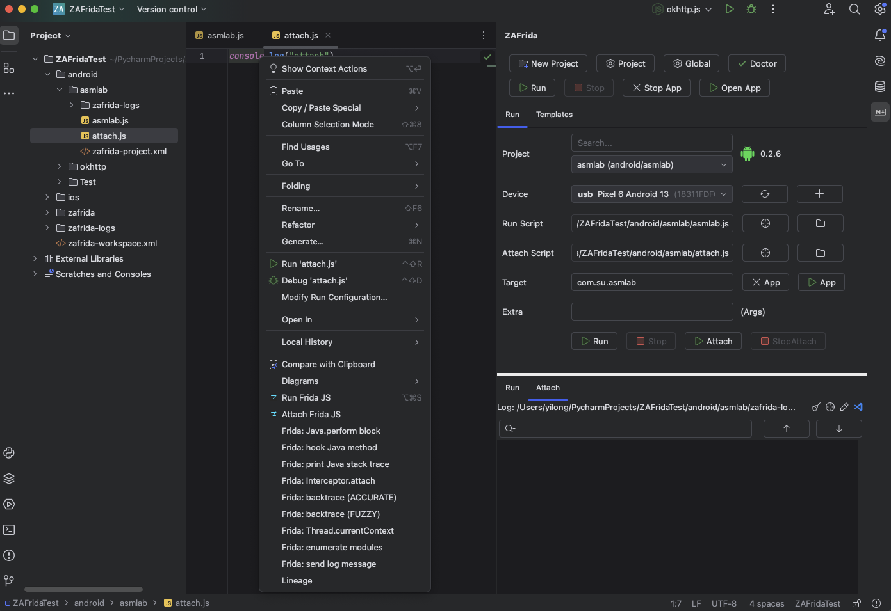
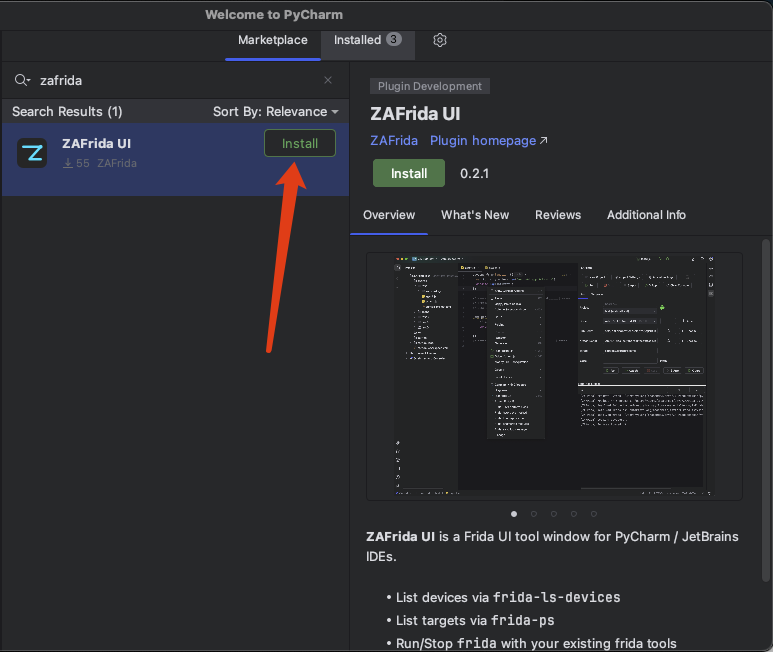
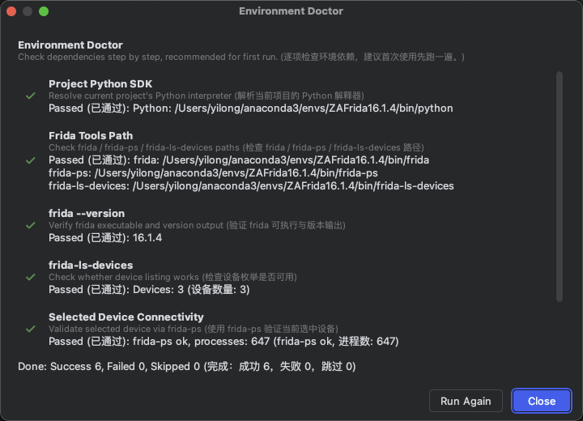
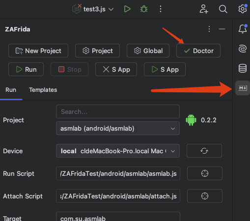
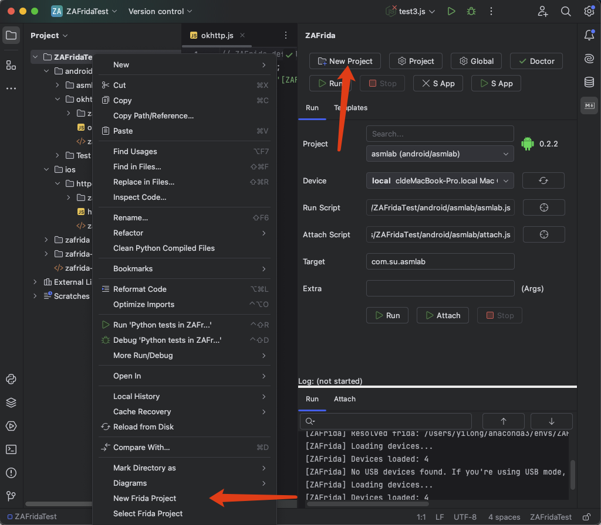
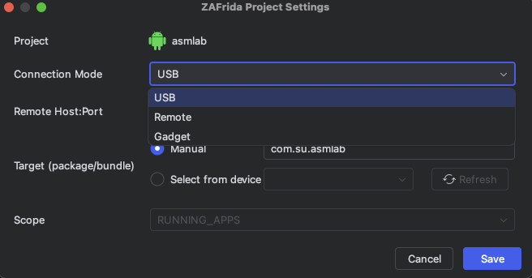
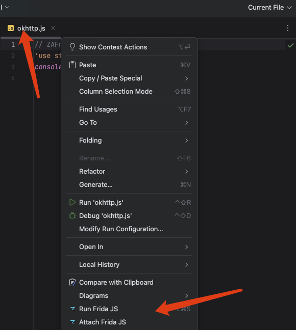
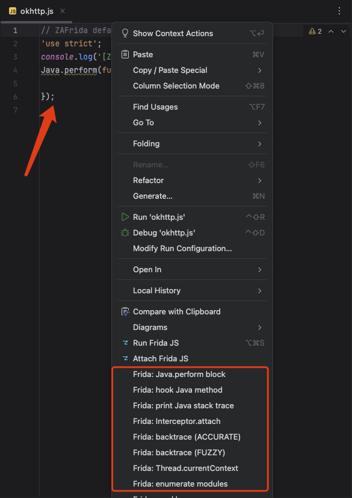
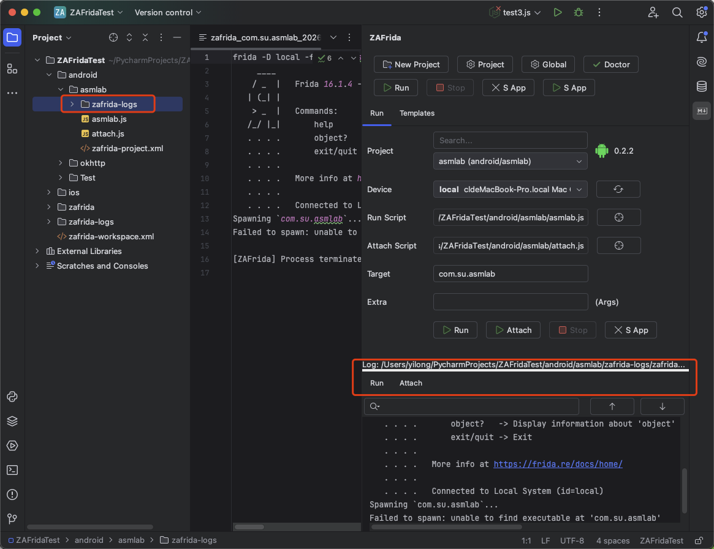
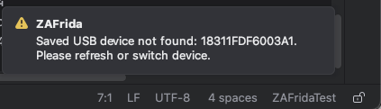

## Frida UI工具(ZAFrida)详细使用教程

### Q1：为什么要开发成PyCharm等IDE的插件?

可以充分使用IDE的编辑能力, git集成, 项目管理能力

---
### Q2：使用IDE的编辑JS脚本有什么优势?

- 代码高亮, 补全, 折叠等编辑功能
- AI辅助编程(如CodeWhisperer, Copilot等)
- 版本管理(git等), 团队协作
- 多文件管理
- 多项目管理

---

### Q3：每次调试为什么要保存日志?

- 首先不管是哪个操作系统Console的输出都是临时的, 关闭IDE就没了
- 其次Console是有容量限制的, 输出过多会被截断
- 最后日志文件方便后续分析和分享

---

### Q4：模版会越来越全吗?

- 我已经和多位大佬沟通完, 后面将把他们和我的实战模版陆续放到模版库里, 也欢迎大家提交PR分享自己的模版

---

### 0x00 先看结论：ZAFrida UI 是干嘛的？

**ZAFrida UI 是一个集成到 PyCharm/IntelliJ 的 Frida 图形化插件：你在 JS 编辑区右键就能 Run/Attach 当前脚本，并且会根据脚本路径自动切换到对应的 ZAFrida 项目上下文（设备/包名/连接方式/参数）；同时提供右键 Snippets 和复选框模板系统，把 Hook 脚本当积木组装。**

[开源仓库](https://github.com/yilongmd/zafrida-ui)



---

### 0x01 准备环境（最短路径）

- 确认你平时可以正常使用frida就行, 建议安装指定的版本(与手机对应), 以免版本不匹配导致各种奇怪的问题
1. 本地 Python 里安装 `frida-tools`
2. 终端确认能跑：`frida --version`、`frida-ls-devices`
3. 设备侧确保 frida-server / gadget 已就绪

---

### 0x02 安装插件

IDE → Plugins → Marketplace → 搜索 **ZAFrida** → Install → 重启



---

### 0x03 第一次打开：医生模块（Environment Doctor）

首次打开 ZAFrida ToolWindow 通常会自动弹出 Doctor。

Doctor 默认检查：

- Project Python SDK
- Frida Tools Path
- frida --version
- frida-ls-devices
- Selected Device Connectivity（若已选设备）
- adb availability（Android）

>adb非强制, 不过如果你做 Android 逆向建议装一下, 这样可以直接在 Run 面板 Force Stop / Open App


>如果没有弹出, 可以手动打开:
>


---

### 0x04 创建你的第一个 ZAFrida 项目

Project View 右键：

- **New Frida Project**

选择 Android / iOS，输入项目名。

>两个方式都可以快速创建:




---

### 0x05 Run 面板：选 4 个字段就能跑

在 ZAFrida → Run 面板：
>默认会选择刚创建的项目
1. Project：选项目
2. Device：选设备
3. Run Script：选脚本
4. Target：填包名/进程名

然后点：

- Run（Spawn）或 Attach（注入已运行进程）
>如果需要Gadget等模式, 点击右上角Frida项目设置(Project按钮)配置:



### 0x06 核心爽点：编辑器右键 Run/Attach

打开任意 `.js` 文件 → 右键：

- Run Frida JS
- Attach Frida JS

>它会根据脚本所在路径自动切换到所属项目并执行。

>方便我们应对多个App, 多台设备, 多种连接模式的调试场景。



---

### 0x07 Snippets：右键插入常用 Hook 片段

右键 → ZAFrida Frida Snippets：

- Java.perform
- hook Java method
- Interceptor.attach
- backtrace (ACCURATE/FUZZY)
- enumerate modules 等



---

### 0x08 Templates：复选框式模板（勾选=插入，取消=注释）

ZAFrida → Templates：

- 勾选模板：插入或取消注释
- 取消勾选：按行 `//` 注释，不删除

模板块 marker 示例：

```js
// ===== [ZaFrida Template Start: <id>] =====
...
// ===== [ZaFrida Template End: <id>] =====
```


---

### 0x09 日志与控制台

- Console：Run/Attach 分 tab
- 落盘日志：默认 `zafrida-logs/`
- Run 面板底部 `Log:` 显示路径



---

### 0x0A 常见通知（看到气泡别慌）

常见提示：

- No device selected → 选设备
- Target is empty → 填包名
- No script file selected → 选脚本
- No Frida project found for this script → 脚本不在项目目录下
- Environment Doctor Found N issues → 打开 Doctor 看失败项



---

（完）

---